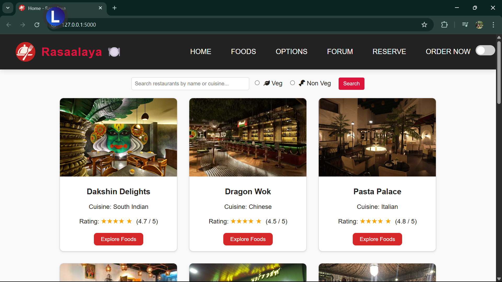
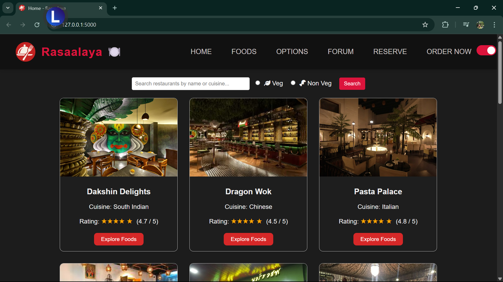
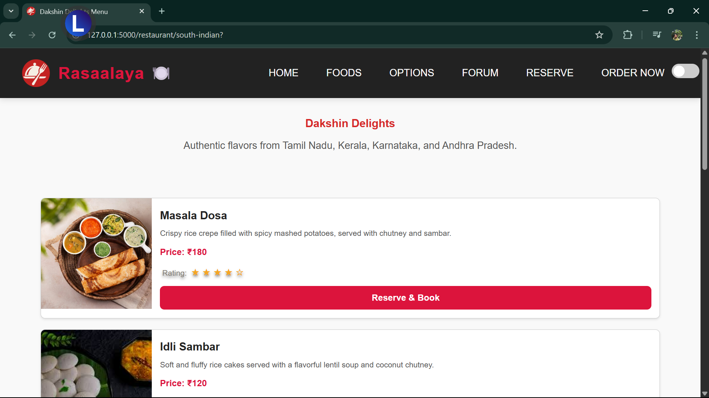
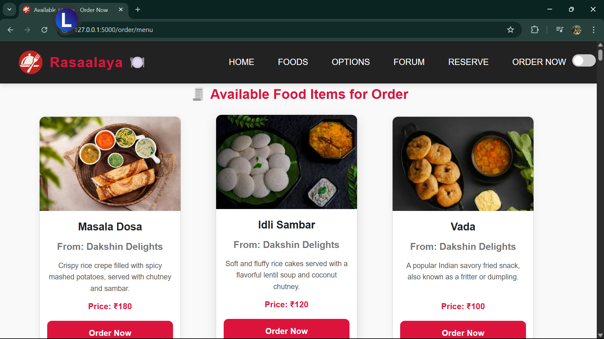

<!--
  ╔═════════════════════════════════════════╗
  ║          Rasaalaya README              ║
  ╚═════════════════════════════════════════╝
-->

<p align="center">
  
  <h1 align="center">Rasaalaya</h1>
  <p align="center">🍽️ Your go-to Flask-powered restaurant listing & ordering platform</p>
</p>

---

## 🏷️ Badges

[](https://www.python.org/)  
[](https://flask.palletsprojects.com/)  
[](LICENSE)  
[](https://github.com/Adyaprana/Rasaalaya)

---

## 📖 Table of Contents

- [About](#about)  
- [Features](#features)  
- [Tech Stack](#tech-stack)  
- [Demo](#demo)  
- [Getting Started](#getting-started)  
  - [Prerequisites](#prerequisites)  
  - [Installation](#installation)  
  - [Running Locally](#running-locally)  
- [Project Structure](#project-structure)  
- [Screenshots](#screenshots)  
- [Configuration & Customization](#configuration--customization)  
- [Contributing](#contributing)  
- [License](#license)  
- [Author](#author)  

---

## 🧐 About

Rasaalaya is a full-featured, responsive web application built with Flask, designed to help users browse restaurants by cuisine, view detailed menus with images, place food orders, and reserve tables. It combines elegant UI/UX (including light/dark modes), dynamic Jinja2 templates, and an intuitive ordering workflow—all in a single codebase.

---

## ✨ Features

- **Restaurant Listings**: Browse by cuisine category or view all restaurants.  
- **Dynamic Menus**: Each restaurant page displays menu items with images, descriptions, prices, and ratings.  
- **Order Workflow**:  
  1. Select food items from a consolidated “Order Now” menu.  
  2. Fill in name, quantity, and address.  
  3. View a summary on a success page.  
- **Table Reservations**: Reserve tables via a simple form with date/time picker.  
- **Community Forum**: Post, read, and comment on food discussions.  
- **Responsive Design**: Mobile-first grid and flex layouts, premium hover/transition effects.  
- **Theme Toggle**: Light and dark modes with preference saved in `localStorage`.  
- **Secure & Clean Code**: Follows Flask best practices, uses `.gitignore` to exclude sensitive or bulky files.

---

## 🛠️ Tech Stack

- **Backend**: Python 3.12, Flask 2.1.1  
- **Frontend**: HTML5, CSS3 (with modern Flexbox & Grid), JavaScript  
- **Templating**: Jinja2  
- **Data Storage**: SQLite (configurable to other DBs)  
- **Version Control**: Git & GitHub  
- **Dev Tools**: VSCode / PyCharm, Prettier (for CSS/JS formatting)

---

## 🎬 Demo

<!-- If you have a live URL, link it here -->
[🔗 Live Demo](#) • [▶️ Demo Video](#)

---

## 🚀 Getting Started

### Prerequisites

- Python 3.7+  
- Git  
- (Optional) Virtual environment tool (venv, pipenv, etc.)

### Installation

```bash
# 1. Clone the repo
git clone https://github.com/Adyaprana/Rasaalaya.git
cd Rasaalaya

# 2. Create a virtual environment
python -m venv venv
# Windows
venv\Scripts\activate
# macOS/Linux
source venv/bin/activate

# 3. Install dependencies
pip install -r requirements.txt

```

## 📂 Project Structure

Rasaalaya/
├── app.py # Main Flask application
├── requirements.txt # Python dependencies
├── LICENSE # MIT License file
├── .gitignore # Excludes venv, cache, etc.
├── static/
│ ├── css/
│ │ └── style.css # Core styles (light/dark, responsive)
│ ├── images/ # All dish & logo images
│ └── js/
│ └── main.js # Theme toggle script
└── templates/
├── base.html # Main layout with header/footer
├── index.html # Home / restaurant listing
├── restaurant.html # Individual restaurant menu
├── order_menu.html # Consolidated “Order Now” page
├── order.html # Order form
├── order_success.html # Order confirmation
├── reserve.html # Table reservation form
├── forum.html # Community forum list
├── view_post.html # Single forum post view
└── … # Other templates


## 📸 Screenshots

| Home (Light)                       | Home (Dark)                        |
|------------------------------------|------------------------------------|
|  |  |

| Restaurant Page                    | Order Now Menu                     |
|  |  |

> *Replace the above placeholders with your actual screenshot filenames.*

## ⚙️ Configuration & Customization

- **Database**: By default, uses SQLite. To switch databases, update the URI in `app.py`.  
- **Environment Variables**: Create a `.env` file (if needed) to store secrets and configuration.  
- **Theme**: Customize light/dark colors in `static/css/style.css`—look for the `:root` and `.dark-mode` sections.  
- **Adding Restaurants**: Edit the `default_restaurants` list in `app.py` or connect to a real database.

## 🤝 Contributing

Thank you for considering contributing! Please follow these steps:

1. **Fork the repository**  
2. **Create a branch**:  
   ```bash
   git checkout -b feature/YourFeatureName
 
##📄 License
Distributed under the MIT License. See LICENSE for more information.

##👤 Author
**Adyaprana Pradhan**

GitHub: @Adyaprana

LinkedIn: linkedin.com/in/adyaprana-pradhan

“Food brings people together on many different levels. It’s nourishment of the soul and body; it’s truly love.” – Giada De Laurentiis
