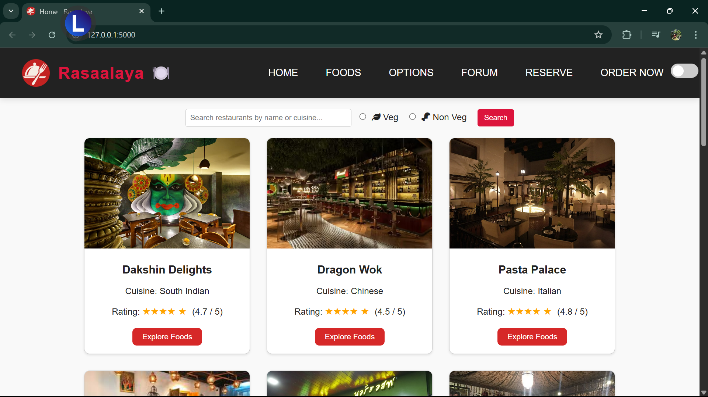
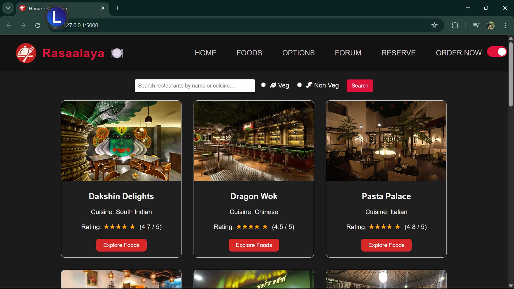
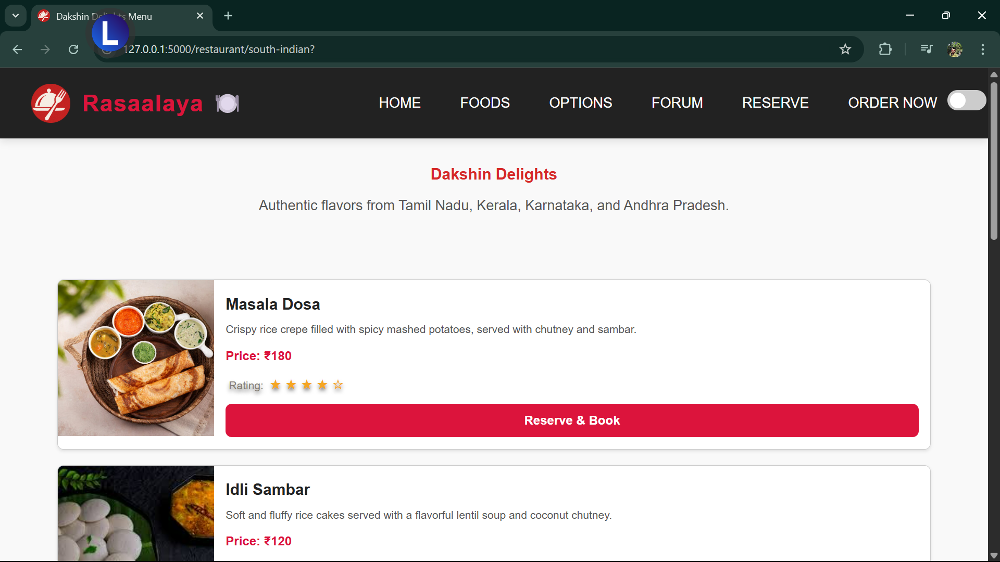
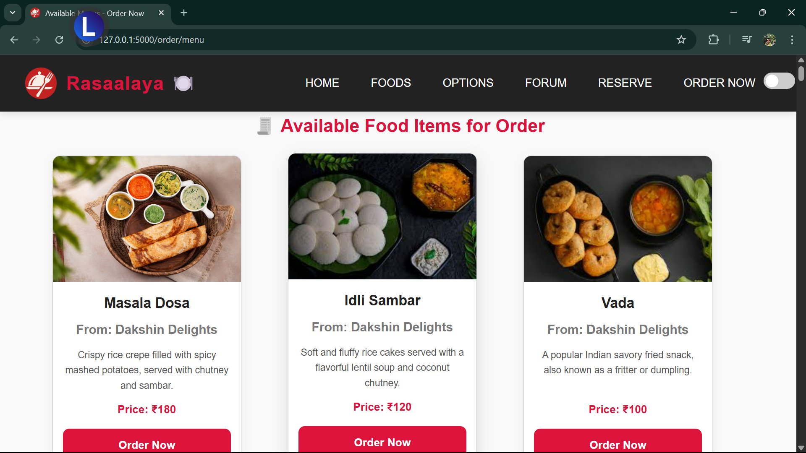

<!--
  ╔═════════════════════════════════════════╗
  ║          Rasaalaya README              ║
  ╚═════════════════════════════════════════╝
-->

<p align="center">
  
  <h1 align="center">Rasaalaya</h1>
  <p align="center">🍽️ <strong>Your go-to Flask-powered restaurant listing & ordering platform</strong></p>
</p>

---

## 🏷️ Badges

[](https://www.python.org/)
[](https://flask.palletsprojects.com/)
[](LICENSE)
[](https://github.com/Adyaprana/Rasaalaya)

---

## 📚 Table of Contents

- 📖 [**About**](#about)
- 🌟 [**Features**](#features)
- ⚙️ [**Tech Stack**](#tech-stack)
- 🎬 [**Demo**](#demo)
- 🚀 [**Getting Started**](#getting-started)
  - ✅ [**Prerequisites**](#prerequisites)
  - 📦 [**Installation**](#installation)
  - 💻 [**Running Locally**](#running-locally)
- 🧱 [**Project Structure**](#project-structure)
- 📸 [**Screenshots**](#screenshots)
- ⚙️ [**Configuration & Customization**](#configuration--customization)
- 🤝 [**Contributing**](#contributing)
- 📄 [**License**](#license)
- 👤 [**Author**](#author)

---

## 📖 About

**Rasaalaya** is a full-featured, responsive **web application** built using **Flask**, designed to let users:

- 🍛 Browse restaurants by **cuisine**
- 📜 View detailed **menus** with images
- 🛒 Place **food orders**
- 📅 **Reserve tables**

This project includes:

- 🎨 Elegant **UI/UX** (Light & Dark Modes)
- ⚡ Dynamic **Jinja2** templates
- 🔁 Seamless and intuitive **ordering workflow**

---

## 🌟 Features

- 🏪 **Restaurant Listings**
- 📸 **Menu with Images**
- 🧾 **Order Placement & Confirmation**
- 📆 **Table Reservations**
- 🌓 **Light/Dark Mode Toggle**
- 💬 **Community Forum**

---

## ⚙️ Tech Stack

- 🐍 **Backend**: `Python 3.12`, `Flask 2.1.1`
- 🖥️ **Frontend**: `HTML5`, `CSS3`, `JavaScript`
- 📄 **Templating**: `Jinja2`
- 💾 **Database**: `SQLite` (easily configurable)
- 🔧 **Dev Tools**: `VSCode`, `PyCharm`, `Prettier`
- 📁 **Version Control**: `Git & GitHub`

---

## 🎬 Demo

<div style="display: flex; justify-content: space-between; flex-wrap: wrap; align-items: center; gap: 2rem; padding: 1rem 0;">

<a href="https://rasaalaya.onrender.com/" target="_blank" style="text-decoration: none;">
  
</a>

<a href="https://www.linkedin.com/feed/update/urn:li:activity:7327239063055273984/?originTrackingId=1b1gbSyGSEObcZHjop9UzQ%3D%3D" target="_blank" style="text-decoration: none;">
  
</a>

</div>

---

## 🚀 Getting Started

### ✅ Prerequisites

- 🐍 **Python 3.7+**
- 🔗 **Git**
- 📦 *(Optional)*: Virtual environment tool like `venv`, `pipenv`

---

### 📦 Installation

```bash
# 1. Clone the repo
git clone https://github.com/Adyaprana/Rasaalaya.git
cd Rasaalaya

# 2. Create a virtual environment
python -m venv venv
# For Windows
venv\Scripts\activate
# For macOS/Linux
source venv/bin/activate

# 3. Install dependencies
pip install -r requirements.txt

```
## 🧱 Project Structure
<details open> <summary>📁 <strong>Folder Overview</strong></summary>
📦 Rasaalaya/
├── 📄 **app.py** – Main Flask application entry point  
├── 📄 **requirements.txt** – Python dependencies  
├── 📄 **LICENSE** – MIT License info  
├── 📄 **.gitignore** – Files and folders to ignore in Git  
├── 📁 **static/** – All static frontend files  
│   ├── 📁 **css/**  
│   │   └── 🎨 **style.css** – Core styles (themes, responsiveness)  
│   ├── 📁 **images/** – Dish & logo images  
│   └── 📁 **js/**  
│       └── 💡 **main.js** – Theme toggle script  
├── 📁 **templates/** – HTML templates with Jinja2  
│   ├── 🧩 **base.html** – Layout with header, footer, theme toggle  
│   ├── 🏠 **index.html** – Home page & restaurant listings  
│   ├── 🍛 **restaurant.html** – Individual restaurant menus  
│   ├── 🛒 **order_menu.html** – Order menu display  
│   ├── ✅ **order_success.html** – Confirmation page  
│   ├── 📦 **order.html** – Order form  
│   ├── 📅 **reserve.html** – Table reservation form  
│   ├── 💬 **forum.html** – Community forum listing  
│   └── 📝 **view_post.html** – Single forum post view  

</details>


## 📸 Screenshots

| 🌞 Home (Light Mode)                                   | 🌚 Home (Dark Mode)                                   |
| ------------------------------------------------------ | ------------------------------------------------------ |
|  |  |
<br>
| 🍴 Restaurant Page                                     | 🛍️ Order Menu Page                                    |
| ------------------------------------------------------ | ------------------------------------------------------ |
|  |  |


## ⚙️ Configuration & Customization

- 🗄️ **Database:** By default, uses SQLite. To switch databases, update the URI in `app.py`.  
- 🛡️ **Environment Variables:** Create a `.env` file (if needed) to store secrets and configuration.  
- 🎨 **Theme:** Customize light/dark colors in `static/css/style.css`—look for the `:root` and `.dark-mode` sections.  
- 🍽️ **Adding Restaurants:** Edit the `default_restaurants` list in `app.py` or connect to a real database.

---

## 🤝 Contributing

1. **Fork the repository**  
2. **Create a branch:**  
   ```bash
   git checkout -b feature/YourFeatureName

---

## 📄 License

Distributed under the **MIT License**. See [LICENSE](LICENSE) for more information.

---

## 👤 Author

**Adyaprana Pradhan**

**GitHub:** [https://github.com/Adyaprana](https://github.com/Adyaprana)  
**LinkedIn:** [https://www.linkedin.com/in/adyaprana21](https://www.linkedin.com/in/adyaprana21)

> “Food brings people together on many different levels. It’s nourishment of the soul and body; it’s truly love.” – *Giada De Laurentiis*
